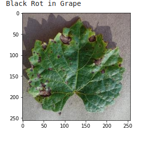
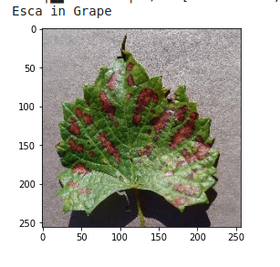
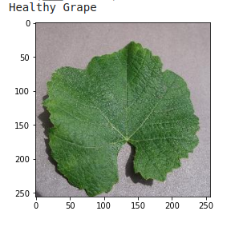

<h3> Hi 👋</h3>

<i>I'm Jeeva, a Passionate Software Engineer. I'm in pursuit of expanding my knowledge and open to exploring opportunities along my way. I prefer to keep learning, continue to challenge myself, and do interesting things that matter.</i>

<h3>About Project 📌</h3>

Crop diseases are a major threat to food security, but their rapid identification remains difficult in many parts of the world due to the lack of the necessary infrastructure. Using a public dataset(Plant Village Dataset) of 54,306 images of diseased and healthy plant leaves collected under controlled conditions, we train a deep convolutional neural network to identify 14 crop species and 26 diseases (or absence thereof). The trained model achieves an accuracy of 99.35% on a held-out test set, demonstrating the feasibility of this approach.

Dataset: [Plant Village Dataset](https://www.kaggle.com/emmarex/plantdisease)

<h3>Technologies Involved 👇🏻</h3>

* Python,OpenCV,Deep Learning  🤖 

 

<h3>Result 👀</h3>

  

 

 

