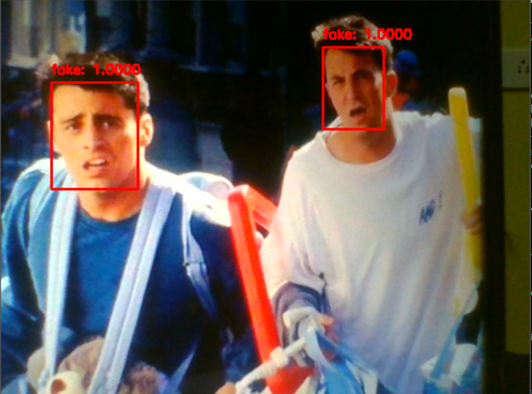

<h3> Hi 👋</h3>

<i>I'm Jeeva, a Passionate Software Engineer. I'm in pursuit of expanding my knowledge and open to exploring opportunities along my way. I prefer to keep learning, continue to challenge myself, and do interesting things that matter.</i>

<h3>About Project 📌</h3>
Face recognition is a method of identifying or verifying the identity of an individual using their face. Face Recognition is becoming more prevalent than ever. As there is a rise in face recognition, which has significantly led to an increase in cybercrime. Liveness detection is the significant step in face recognition, to make the system more secure. 

<h3>Technologies Involved 👇🏻</h3>

* Python,OpenCV,Deep Learning  🤖 

 

<h3>Result 👀</h3>

 

 

 

