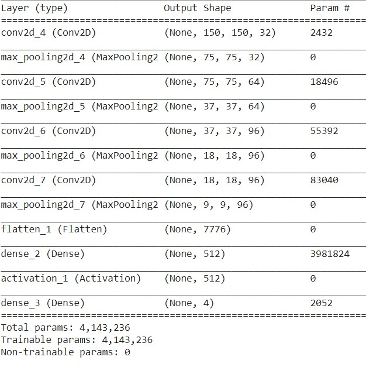
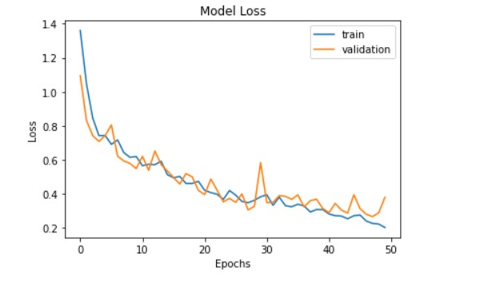
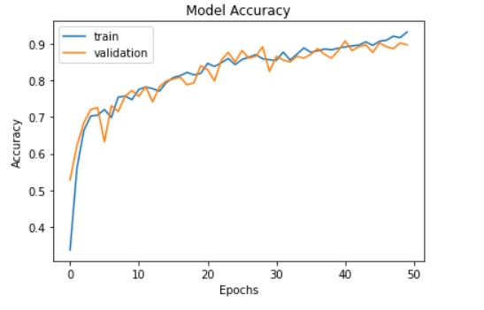

[](https://www.python.org/)

# Flower Classification using Convolutional Neural Networks

## Overview
Convolutional Neural Networks Model is created to classify the flowers dataset into 4 categories
* Daisy
* Dandelion
* Rose
* Sunflower

## Model
<p align="left">
 &ensp;&ensp;&ensp;&ensp;&ensp;&ensp;&ensp;&ensp;&ensp;
</p>

## Performance
<p align="left">
 &ensp;&ensp;&ensp;&ensp;&ensp;&ensp;&ensp;&ensp;&ensp;
 &ensp;&ensp;&ensp;&ensp;&ensp;&ensp;&ensp;&ensp;&ensp;
</p>

## Prerequisites
* Python 3 
* an IDE (preferably Google Colab)
* Pandas 
* Numpy 
* Matplotlib 
* Seaborn
* Sklearn
* Keras
* Tensorflow
* OpenCV


All the external dependencies can be installed by using ```pip install -r requirements.txt```

## Author
* Rishikesh Sivakumar

[](https://GitHub.com/Naereen/) by [Rishikesh Sivakumar](https://www.linkedin.com/in/rishikesh-sivakumar-1a166a18b/)

