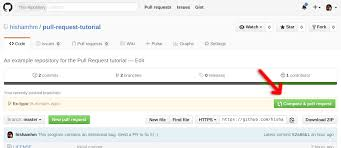

# Want to contribute in this project:
<p>If you want to contribute in the project then checked the issue section on github and issue which is suitable for you and match to your skill set just asked for assigning for issue .</p> 

<p></p>

<p>Once the issue is assigned to you <br>
    follow this steps:</p>

1. Fork this repository .
2. Clone your forked copy of the project.

    ``` 
    git clone https://github.com/<Your_Github_Profile>/<Project_Name>.git
    ```
    
3. Navigate to the project directory.

    ```
    cd <Project Directory>
    ```

4. Add a reference(remote) to the original repository.

    ```
    git remote add upstream https://github.com/<Your_Github_Profile>/<Project_Name>.git
    ```

5. Check the remotes for this repository.

    ```
    git remote -v
    ```

6. Always take a pull from the upstream repository to your master branch to keep it at par with the main project(updated repository).

    ```
    git pull upstream main
    ```

7. Create a new branch.

    ```
    git checkout -b <your_branch_name>
    ```

8. Perfom your desired changes to the code base/files.

9. Track your changesheavy_check_mark .

    ```
    git add .
    ```

10. Commit your changes .

    ```
    git commit -m "Relevant message"
    ```

11. Push the committed changes in your feature branch to your remote repo.

    ```
    git push -u origin <your_branch_name>
    ```

12. To create a pull request, click on compare and pull requests.
<p></p>

13. Add appropriate title and description to your pull request explaining your changes and efforts done.

14. Click on Create Pull Request.

15. Congrats✌🎉  You have made a PR to the **this project** project boom . Wait for your submission to be accepted and your PR to be merged.


